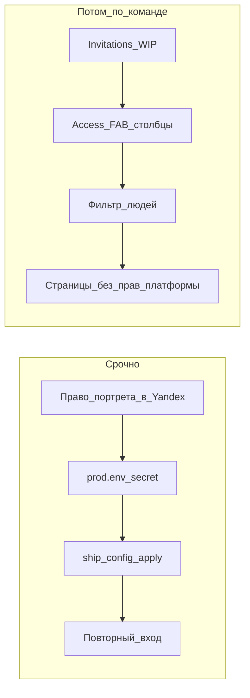

# Портреты Яндекса сейчас; доступы и приглашения — потом

## Срочно: фото из Яндекса

**Почему сейчас пусто.** Код уже умеет брать портрет: в [`providers.py`](platform/core/platform_core/services/providers.py) из ответа `/info` читаются `default_avatar_id` / `is_avatar_empty`. Если этих полей нет — права на портрет у OAuth-приложения нет; при входе один раз пишется предупреждение в лог ядра (`sign_in._warn_once_about_avatars`). Картинка пишется в `subject.avatar_id` **на каждом входе** — без нового входа старые профили не обновятся.

**Что не чинится кодом платформы.** Нужно включённое в кабинете Яндекса «Доступ к портрету пользователя» (вы это как раз меняете). Отдельный `scope` в URL авторизации код не шлёт — у Яндекса право задаётся настройкой приложения.

**Локально зафиксировано (09.10.2026, без пуша):** в [`infra/prod.env`](infra/prod.env) уже стоят

- `PLATFORM_YANDEX_CLIENT_ID=2171aabc1c3242878f336a40a7b94089`
- `PLATFORM_YANDEX_CLIENT_SECRET=c9396a8f0c9a474c96b42b0d512d0b05`
- redirect без изменений

Значения совпали с присланными — файл не менялся. На прод секреты пишет сессия установки напрямую; централизованный `ship --config` + `apply` — при выполнении этого плана (не пушим env в git).

**При выкате плана:**

1. `bash deploy/release/ship.sh <текущий-тег> --config` → на сервере `./deploy/server/apply.sh <тот же тег>`.
2. Проверка: вход через Яндекс → в `/info` есть поля аватара → фото в UI; в логах ядра нет «право на фотографию приложению не выдано».
3. Уже вошедшие один раз выходят и входят снова — иначе `avatar_id` не обновится.

Главное для фото сейчас — право «портрет» в кабинете Яндекса (secret/client id те же); без повторного входа картинка у старых сессий не появится.

---

## Потом (только когда скажете «делай»)

Незавершённое и надиктованное — одна очередь в ветке задачи (сейчас есть WIP [`task/invitations-compact-layout`](web/src/pages/Invitations.tsx)).

### 1. Добить «Организации и приглашения» (WIP)

Уже частично в ветке: `Tiles` в ряд, без столбца «Вид», наша строка `pf-row-chosen`, короткие «Кто» / места `2/5` / «ждёт», копирование по клику на строку.

Доделать: оставшиеся правки тестов, прогон `Invitations.test.tsx`, убрать «Сейф» из меню (манифест в коде без `safe` — на бою обновить реестр перезапуском ядра / `ensure_platform_registered`).

### 2. Экран доступов — FAB и столбцы

Файл: [`web/src/pages/Access.tsx`](web/src/pages/Access.tsx).

- Сейчас карточка человека (`state.who` → `<Access />`) и пачка (`RightsInBatch`) **под** длинной таблицей — отсюда прокрутка.
- Сделать плавающую кнопку справа внизу (как чат): видна, когда выбран человек (`who`) и/или отмечены галочками; по нажатию открывает панель выдачи (тот же `Access` / batch), без необходимости скроллить таблицу. Клик по строке по-прежнему выбирает человека и подсвечивает (`selected` / `pf-row-chosen`).
- Сжать столбцы с замером по `frontend-ui` / `table-widths`: почта/логин — локальная часть (домен в hint); человек и организация — `nowrap` + Clipped; убрать «(внешняя)» из текста ячейки; столбец «Чем занимается» **не показывать**, если у всех в выборке пусто; чекбокс уже `w-8` — проверить визуально; «Порталы» — не раздувать строку (ограничение высоты ячейки ~3 строки / обрезка с подсказкой). Доли пересчитать так, чтобы сумма оставляла место пиксельным столбцам.

### 3. Кого видно в списке людей

Частично уже есть: грантор без права платформы фильтруется через [`rights.sees_person`](platform/core/platform_core/services/rights.py) и область видимости на `platform` ([`people` в administration.py](platform/core/platform_core/api/administration.py) ~414–421).

Нужная модель (дольше проверок):

| Кто | Список людей | Организации | Приглашения |
|---|---|---|---|
| Внешний | не нужен / только своя орг. | нет справочника | только в свою орг. |
| Внутренний не-админ | только наша (внутренние) | нет или только своя | в пределах своих прав |
| Админ платформы | все | полный справочник | любые в пределах И-14 |

Отличие от текущего: у внутреннего с `visibility=all` на платформе сейчас видны и внешние — для не-админа это сузить до внутренних субъектов.

### 4. Большой контур: страницы без выдачи прав платформы

Цель: не назначать людям разделы «Доступы» и «Организации и приглашения» платформы вручную; достаточно `grant` в любом приложении.

Уже заложено решением 0032: [`GRANTING_SECTIONS`](platform/core/platform_core/services/rights.py) открывает `rights` и `invitations` в навигации тому, у кого `granting_of(...).anywhere`. Объём работ — довести UI/API до модели из п.3 (что внутри страниц видно и что можно сделать), закрыть пробелы тестами неповышения (И-14), З-27, З-21, и не развести второй путь выдачи (З-19).

Оценка порядка: п.1–2 — UI (~5–8 SP); п.3–4 — права и видимость (~13+ SP, много DB-тестов).

## Вне контракта этого плана

- Смена client_id / redirect URI (только если вы явно скажете, что сменились).
- Перенос старых аватаров без повторного входа.
- Полная реализация п.4 до явной команды «делай».
